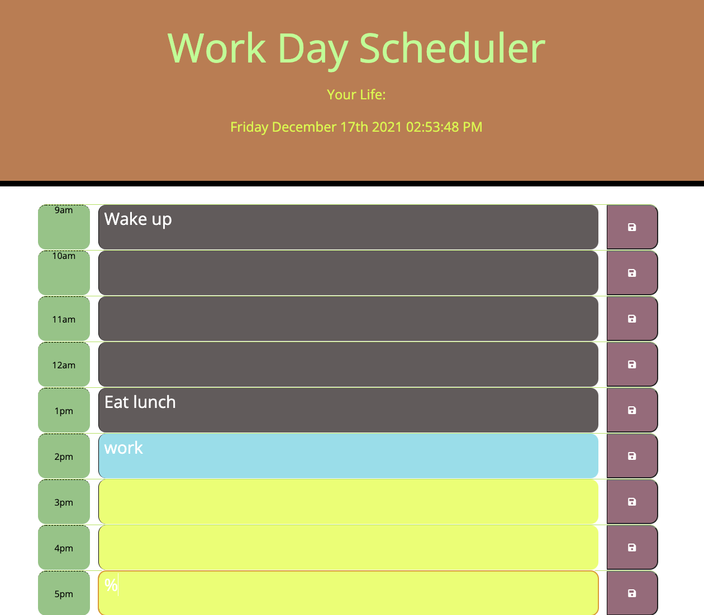

# scheduler

This scheduler only support hours from 9am - 5pm

User Guide:

- check your current date and time under "Your Life".
- scrool down the page for rows with time of the day displaying inside a green box on the left of each row.
- enter any text within row textarea, then click on the save button on the right of each row to keep the input.
- row in current time display blue.
- row in the past displays grey.
- row in the future display yellow-green.
- User inputs will be store in localstorage.

